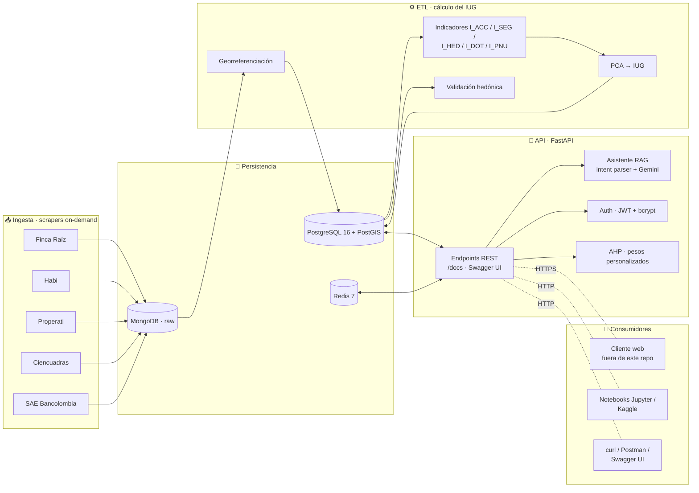
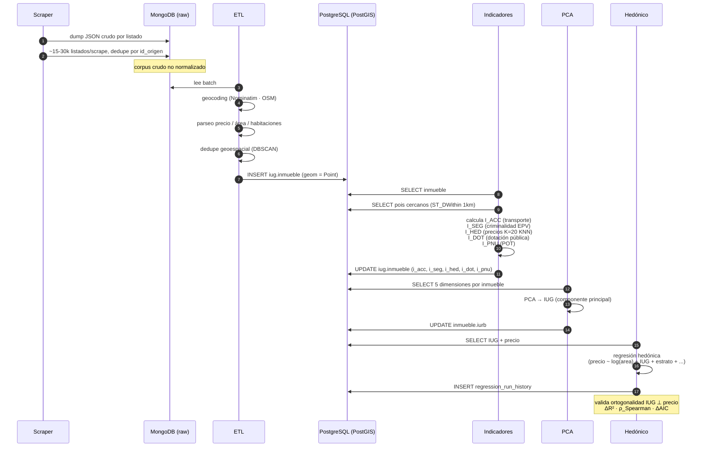
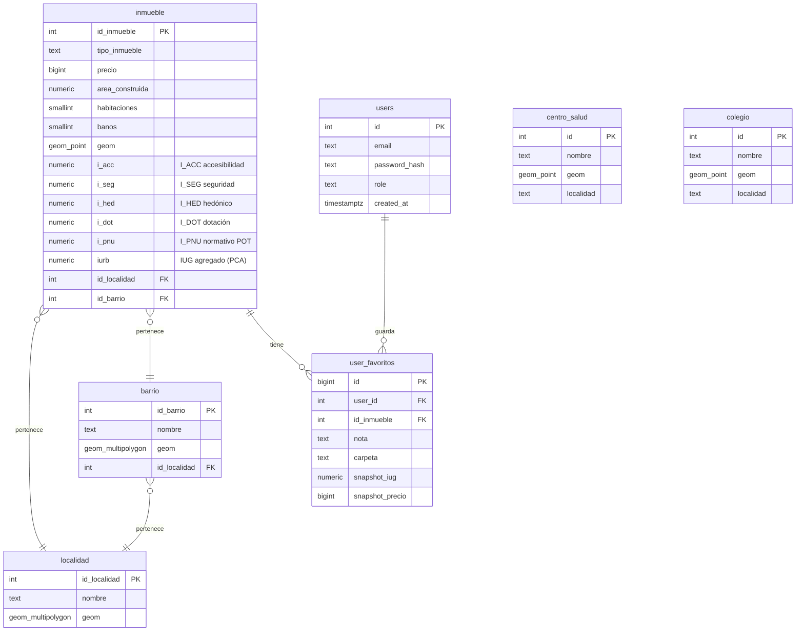
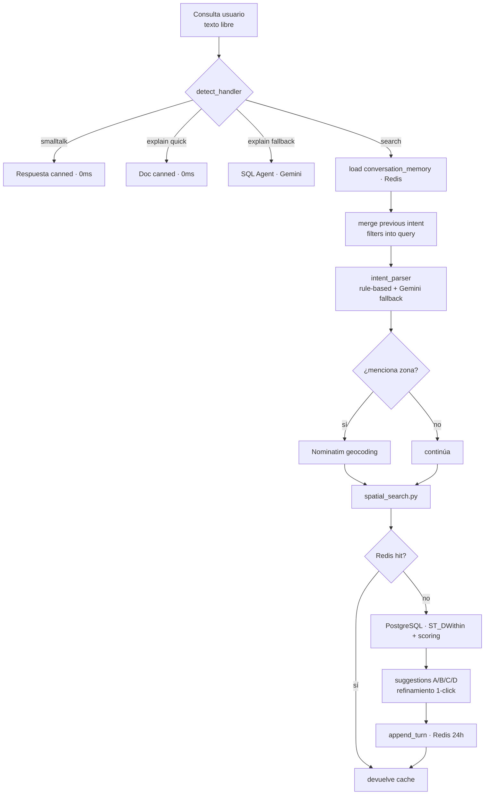
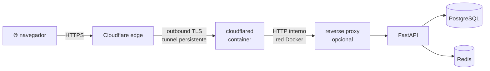

# Arquitectura · Índice Urbano Global de Bogotá

Documento técnico de arquitectura. Para la justificación metodológica del IUG
consulta [`Doc_final.tex`](Doc_final.tex) y la carpeta [`docs/`](docs/).

---

## 1. Vista de alto nivel

---

## 2. Stack

| Capa | Tecnología | Por qué |
|---|---|---|
| **API** | FastAPI 0.115 · uvicorn · asyncpg · redis-asyncio | Asíncrono nativo, OpenAPI auto-generado, ecosistema Python rico para datos geoespaciales |
| **DB** | PostgreSQL 16 + PostGIS 3.4 + pgvector | Único motor que combina queries espaciales, vector similarity y SQL transaccional |
| **Cache** | Redis 7 | Memoria conversacional del RAG (TTL 24h) + cache de búsquedas frecuentes |
| **Migraciones** | Flyway 10 | Migraciones SQL versionadas, idempotentes, con rollback automático |
| **Scraping** | Scrapy 2.11 · Selenium Grid · Playwright | Coexisten 3 enfoques porque cada portal tiene un anti-bot distinto |
| **LLM** | Gemini Flash 1.5 (vía REST oficial) · LangChain | Latencia <800ms, tier free generoso, RAG con SQL grounding |
| **Reverse proxy** | Nginx + Cloudflare Tunnel | Despliegue público sin abrir puertos en el router |
| **Monitoring** | Prometheus 2.51 + Grafana 10 + postgres_exporter / redis_exporter | Estándar de la industria, dashboards JSON versionados |

---

## 3. Pipeline del IUG (de scrape a indicador)

---

## 4. Modelo de datos (schema `iug`)

Migraciones Flyway en [`services/database/migrations/`](services/database/migrations/) — más de 120 archivos versionados (`V1` → `V121`), cada uno idempotente.

---

## 5. API · endpoints principales

| Prefijo | Función | Auth |
|---|---|---|
| `/inmueble/*` | CRUD inmuebles, estadísticas, búsqueda paginada | No (lectura) / sí (escritura) |
| `/geo/*` | GeoJSON de localidades, barrios, puntos | No |
| `/iurb/*` | Detalle del IUG por inmueble, oportunidades, recálculo | No |
| `/llm/*` | Chat conversacional + búsqueda en lenguaje natural | JWT opcional |
| `/auth/*` | Login, registro, verificación OTP | — |
| `/favoritos/*` | Inmuebles guardados por usuario | JWT |
| `/acm/*` | Análisis Comparativo de Mercado, PDF | JWT |
| `/regression/*` | Modelos hedónicos guardados, Lasso/Elastic Net | JWT (admin) |
| `/admin/*` | Panel de administración, recomputaciones | JWT (admin) |
| `/pipeline/*` | Ingesta autenticada desde scrapers | `PIPELINE_SECRET` |
| `/analytics/*` | KPIs de uso y conversiones | JWT (admin) |
| `/metrics` | Métricas Prometheus | No |
| `/health` | Healthcheck (keepalive Cloudflare) | No |
| `/docs` | **Swagger UI interactivo** (auto-generado por FastAPI) | No (dev) |

---

## 6. Asistente RAG · cómo funciona

El router clasifica la consulta en 6 categorías antes de tocar el LLM:

1. **smalltalk** ("hola", "gracias") → respuesta inmediata, 0 tokens
2. **explain (quick)** ("qué es IUG", "cómo se calcula I_ACC") → doc pre-renderizado
3. **explain (fallback)** → SQL Agent con grounding sobre el schema
4. **stats** (agregados por localidad) → query SQL directo
5. **compare** (inmueble A vs B) → dos lookups + diff
6. **search** → flujo completo de spatial search

Memoria conversacional en Redis (clave `chat:{session_id}`, TTL 24h, hasta 10 turnos) preserva el intent previo para que "ahora en chapinero" extienda la búsqueda anterior sin perder filtros.

---

## 7. Despliegue de referencia (Cloudflare Tunnel)

Beneficios:

- **Cero puertos abiertos** en el router doméstico — Cloudflare establece la conexión saliente
- TLS terminado en el edge de Cloudflare, con HTTPS gratuito
- Subdominios múltiples sin DNS adicional: `api.dominio.com`, `dashboard.dominio.com`, etc.
- DDoS / WAF de Cloudflare incluido en tier free

Config en el panel Cloudflare → no hay archivos secretos en el repo. El único valor sensible es el `CLOUDFLARE_TUNNEL_TOKEN` (en `.env`, nunca en el repo).

---

## 8. Decisiones de diseño relevantes

| Decisión | Por qué |
|---|---|
| FastAPI vs Flask/Django | Async nativo + OpenAPI gratis + tipado Pydantic |
| asyncpg vs SQLAlchemy ORM | Latencia crítica en queries espaciales; ORM agrega 30-50ms |
| Flyway vs Alembic | Migraciones SQL puras, audit-friendly para tesis |
| MongoDB para raw | Schema-less; cada scraper devuelve JSON con campos distintos |
| PostgreSQL para procesado | PostGIS + pgvector + transaccional en un solo motor |
| Redis para memoria conversacional | TTL nativo, sub-ms p99, sin schema rigid |
| PCA para agregar el IUG | Componente principal único maximiza varianza explicada; alternativa AHP por usuario también soportada |
| Gemini Flash vs GPT-4 | Tier free generoso · latencia 600-800ms · suficiente para intent parsing |
| `app_user` con permisos limitados | Defensa en profundidad: si la API es comprometida, el atacante no puede DROP TABLE |
| Tests de regresión hedónica en CI | Detecta regresiones de calidad del IUG cuando se reentrenan los pesos |
